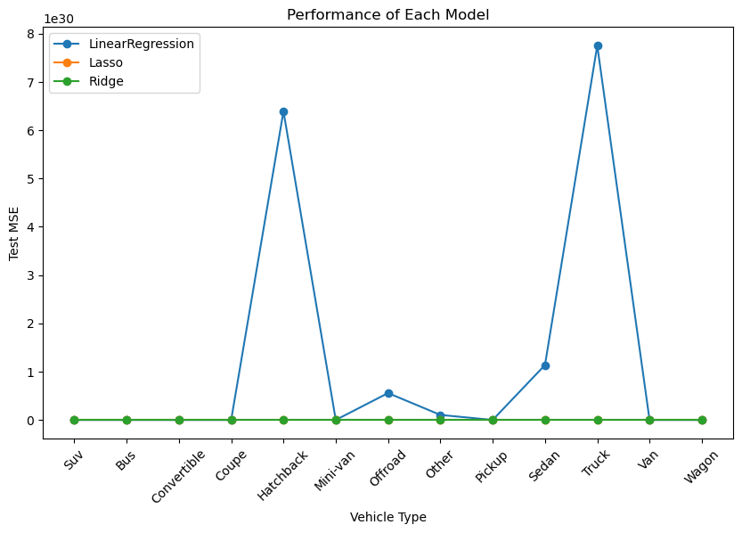
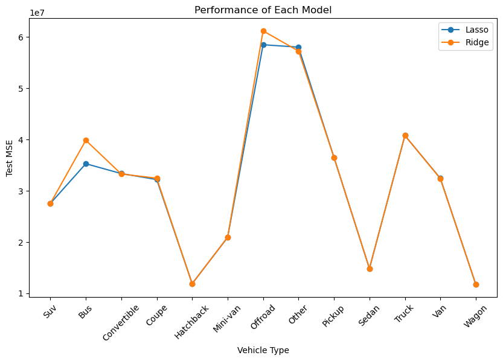

# Data-Driven Insights into Used Car Features that Drive Prices

Jupyter Notebook with code, experimentation, further insights, and deployment strategies: [here](prompt_II.ipynb).

## Business Goal

Determine which features drive a used car's price. These features could be used to make decisions on new trade-ins, purchases, or in how a particular car might be advertised. 

## Data

The dataset was provided as part of the project. It contains information on 426K used cars and their sale prices.  

The data included several numerical columns and a large amount of categorical data.

## Modeling and Performance

In the competitive used vehicle market, understanding the key factors that drive pricing is essential to maximize profits. Our analysis of recent sales data has uncovered valuable insights into the features that matter most to buyers, empowering you to strategically price your inventory for maximum returns.

In this analysis we used Linear Regression, Lasso regression, and Ridge regression to find best model for prediction.  Lasso regression outperformed the other models with a √MSE of 5484.515.  

**Key Insights:**

* **Year and Odometer:** Unsurprisingly, the age and mileage of a vehicle remain the most significant factors across almost all categories. Emphasize low mileage and newer models in your marketing to attract buyers willing to pay a premium.
* **Fuel Type:** For Pickup, Truck, and Van segments, the fuel type (gas vs. diesel) is a crucial consideration. Highlight fuel efficiency for gas-powered vehicles and the power/durability of diesel options to cater to different buyer preferences.
* **Drive Type:** In Hatchback and Sedan categories, the drive type (FWD vs. RWD/AWD) plays a role in pricing. Showcase the fuel efficiency and handling benefits of FWD for everyday drivers while emphasizing the performance and all-weather capabilities of RWD/AWD options for specific needs.
* **Manufacturer:** For certain vehicle types (Minivan, Offroad, Wagon), the brand reputation can significantly impact the price. Leverage the popularity and reliability of specific manufacturers like Toyota, and Lexus to justify higher prices.
* **Additional Factors:**  Our analysis found other factors like the number of cylinders (for SUVs and Coupes) and whether a vehicle is 4WD (for "Other" category vehicles) can also influence price.

## Conclusions

**Used Car Pricing Cheat Sheet: Top 3 Factors**

This cheat sheet identifies the top three features that most significantly impact the price of a used vehicle, based on recent sales data analysis. For each feature, we indicate whether a higher (+) or lower (-) value generally leads to a higher sale price.

| Vehicle Type | Top Factor 1 (+/-) | Top Factor 2 (+/-) | Top Factor 3 (+/-) |
|---|---|---|---|
| SUV          | Year (+)            | Odometer (-)       | Cylinders (+)      |
| Bus          | Year (+)            | Odometer (-)       | Volkswagen (-)     |
| Convertible  | Year (+)            | Odometer (-)       | Chrysler (-)       |
| Coupe        | Year (+)            | Odometer (-)       | Cylinders (+)      |
| Hatchback    | Year (+)            | Odometer (-)       | FWD (-)            |
| Minivan     | Year (+)            | Odometer (-)       | Toyota (+)          |
| Offroad      | Year (+)            | Odometer (-)       | Ram (-)            |
| Other        | Year (+)            | Odometer (-)       | 4WD (+)            |
| Pickup       | Year (+)            | Odometer (-)       | Fuel_gas (-)       |
| Sedan        | Year (+)            | Odometer (-)       | FWD (-)            |
| Truck        | Year (+)            | Odometer (-)       | Fuel_gas (-)       |
| Van          | Year (+)            | Odometer (-)       | Fuel_gas (-)       |
| Wagon        | Year (+)            | Odometer (-)       | Lexus (+)          |

**Key:**

* **+** indicates a higher value of the factor typically increases the price.
* **-** indicates a lower value of the factor typically increases the price. 
